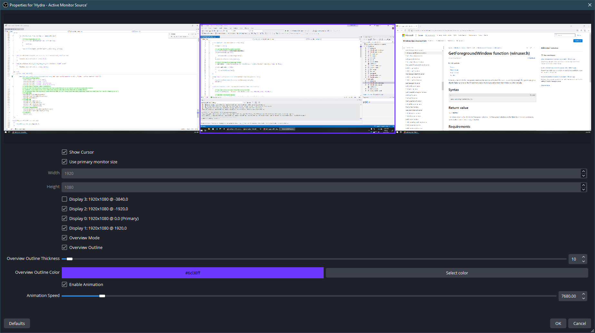

OBS Hydra: An OBS plugin for multi-monitor streaming
=======================================================================================================================

OBS Hydra is a plugin for [OBS Studio](https://obsproject.com/). It adds a source which acts as a display capture that follows your focused monitor (which is inferred from which window has focus.)

Currently only Windows is supported. (Keeping track of the active monitor and the OBS bits for capturing screens is very platform-specific.)

The plugin has been tested with various OBS Studio versions from 21.1.2 to 29.1.3. I originally made it over the course of a long weekend in 2018 because I wanted to try doing coding streams without giving up my multi-monitor workflow.

## License

This project is licensed under the GPLv2 License. [See the license file for details](LICENSE.txt).

At your option, `HydraCore` and other miscellaneous files outside of the `obs-hydra` and `external` directories may be licensed under the MIT License, as they do not rely on OBS directly. See [`HydraCore/LICENSE.txt`](HydraCore/LICENSE.txt) for details.

## Features

* Show your focused display to your audience
* Overview mode: Allow your viewers to see a minimap of all of your displays at once
* Overview outline: Puts a highlight on overview mode that follows your focused display
* Display filtering to only show relevant displays to your audience
* Sliding animation between displays as they change to avoid jarring transitions
* Stream without changing your multi-monitor workflow!

## Limitations

* HDR is currently unsupported
* Capture method is currently hard-coded to DXGI Desktop Duplication

## Building

* Ensure Git submodules are up-to-date with `git submodule update --init --recursive`
* For the sake of convenience, this repository contains the import library for libobs (`external/obs.lib`)
    * If you do not wish to use this pre-built binary, see [the notes on building OBS yourself](external/UpdatingObs.md).
* Open the Visual Studio solution in Visual Studio 2022 and build.
